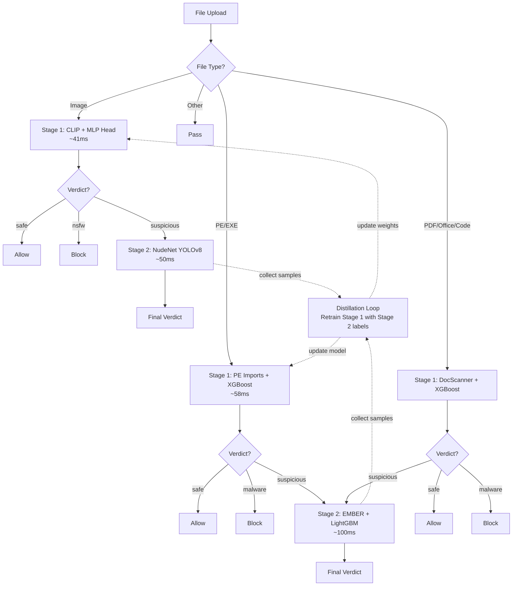
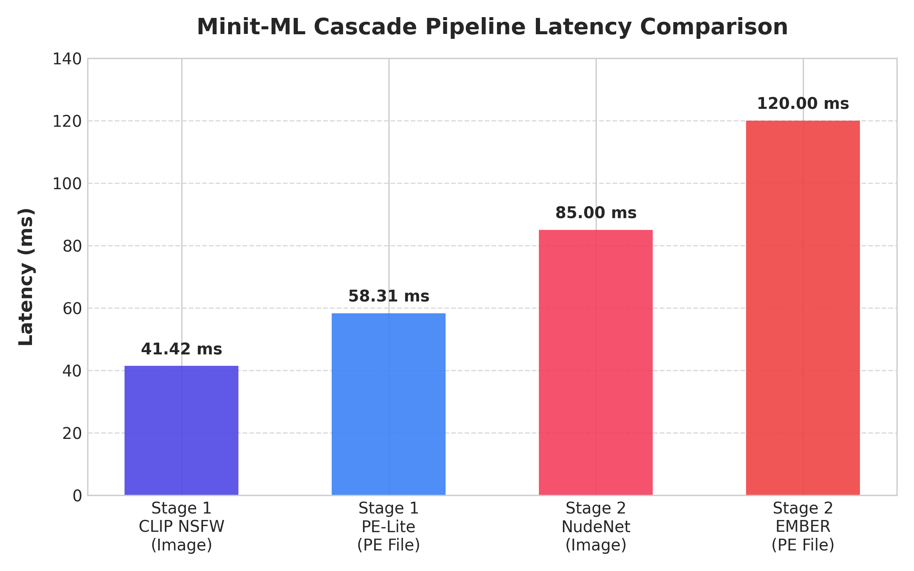
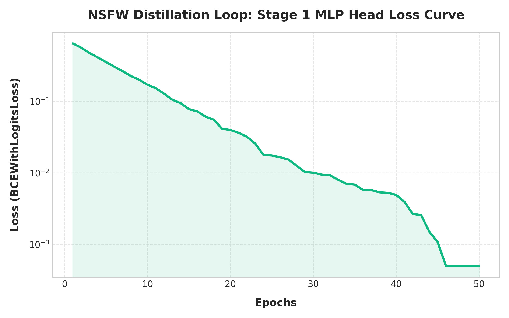

# Minit-ML

<p align="center">
  
</p>


Two-stage cascade content moderation with knowledge distillation for the Minit file sharing service.

## Overview

Minit-ML scans uploaded files for **NSFW images** and **malware** using a two-stage approach.

| Category | Formats |
|----------|---------|
| Images | `.jpg` `.png` `.gif` `.bmp` `.webp` |
| Executables | `.exe` `.dll` `.sys` (PE) |
| Documents | `.pdf` `.pptx` `.docx` `.xlsx` `.ppt` `.doc` `.xls` |
| Code | `.py` `.js` `.ts` `.sh` `.ps1` `.rb` `.php` `.java` `.c` `.cpp` `.go` `.rs` `.lua` `.vbs` `.bat` and others |

1. **Stage 1 (Lightweight)**: Fast models (~50ms) filter the majority of files on the synchronous upload path
2. **Stage 2 (Heavy)**: Suspicious files are verified asynchronously by more accurate models
3. **Distillation**: Stage 2 results are fed back to retrain Stage 1, reducing Stage 2 calls over time

## Architecture



## Technology Stack

- **Language**: Python 3.10+
- **Framework**: FastAPI + Uvicorn
- **Stage 1 NSFW**: OpenAI CLIP (ViT-B/32) + PyTorch MLP head
- **Stage 1 Malware (PE)**: pefile import feature extraction + XGBoost
- **Stage 1 Malware (Doc/Code)**: PDF/Office/OLE/Code structural features + XGBoost
- **Stage 2 NSFW**: NudeNet (YOLOv8-nano ONNX, 18 body-part classes)
- **Stage 2 Malware**: EMBER PE features + LightGBM
- **Distillation**: Soft-label BCE (NSFW) / Pseudo-label XGBoost retrain (Malware)

## Quick Start

```bash
# 1. Setup environment and install dependencies
make setup

# 2. Train initial models
make init

# 3. Start API server on port 8099
make run
```

The server exposes `POST /scan` for synchronous Stage 1 scanning. Suspicious files are automatically queued for background Stage 2 verification.

### Available Make Targets

```
make setup           # Create venv, install dependencies
make init            # setup + train all initial models
make run             # Start FastAPI server on :8099
make distill-nsfw    # Trigger NSFW distillation
make distill-malware # Trigger malware distillation
make clean           # Remove caches and temp files
```

## API Quick Reference

| Endpoint | Method | Description |
|----------|--------|-------------|
| `/scan` | POST | Stage 1 scan (multipart file upload) |
| `/verify/{file_hash}` | GET | Check Stage 2 verification status |
| `/distill/{domain}` | POST | Trigger distillation (`nsfw`, `malware`, `all`) |
| `/stats` | GET | Buffer counts and pipeline status |
| `/health` | GET | Health check |

## Project Structure

```
.
├── pipeline.py              # Pipeline orchestrator and FastAPI server
├── config.yaml              # Thresholds, model params, distillation config
├── src/
│   ├── stage1/
│   │   ├── clip_nsfw.py     # CLIP + MLP head NSFW detector
│   │   ├── pe_lite.py       # PE import features + XGBoost detector
│   │   └── doc_scanner.py   # PDF/Office/OLE/Code features + XGBoost detector
│   ├── stage2/
│   │   ├── nudenet_nsfw.py  # NudeNet YOLOv8 ONNX detector
│   │   └── ember_malware.py # EMBER PE features + LightGBM detector
│   └── distillation/
│       ├── nsfw_distill.py  # Soft-label distillation for MLP head
│       └── malware_distill.py # Pseudo-label distillation for XGBoost
├── models/                  # Trained model weights
├── data/                    # Training data and distillation buffers
└── references/              # Upstream repos (NudeNet, EMBER, etc.)
```

## Benchmarks

### Latency Comparison



| Model | File Type | Avg Latency | Throughput |
| :--- | :--- | :--- | :--- |
| **PE-Lite (Stage 1)** | PE (.exe, .dll) | 58.31 ms | 17.15 files/sec |
| **CLIP NSFW (Stage 1)** | Image (.jpg, .png) | 41.42 ms | 24.15 images/sec |

### Distillation Loss Curve



Stage 1 CLIP MLP head training loss using soft labels from Stage 2, converging to ~0.001 after 50 epochs.
